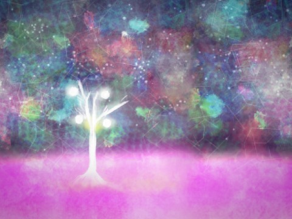
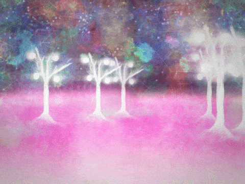
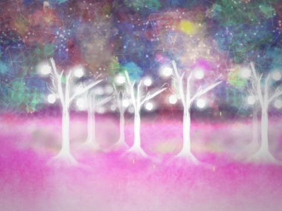
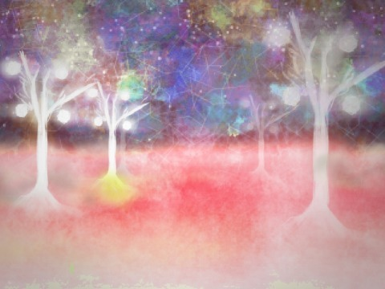
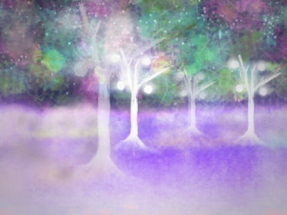

# Quantum Forest

Explore an ethereal 3D forest environment with hand-drawn digital art, built in the Scratch programming language.

UPDATE: Almost a year after the assignment, I came back to Scratch to discover it had been featured on the home page, with almost 30,000 views.

[View in Browser](https://scratch.mit.edu/projects/83958956)

---

Assignment for: MAS.110 Computational Media Design

In Collaboration with: Emily Ramirez

Learning Focus: 3D Projection Matricies, Visibility Culling, Working with Constrained Graphics, Integrating Visual Assets

Media: Interactive Art, Digital Artwork, Scratch Project

Software: Scratch

Date: October 2015

